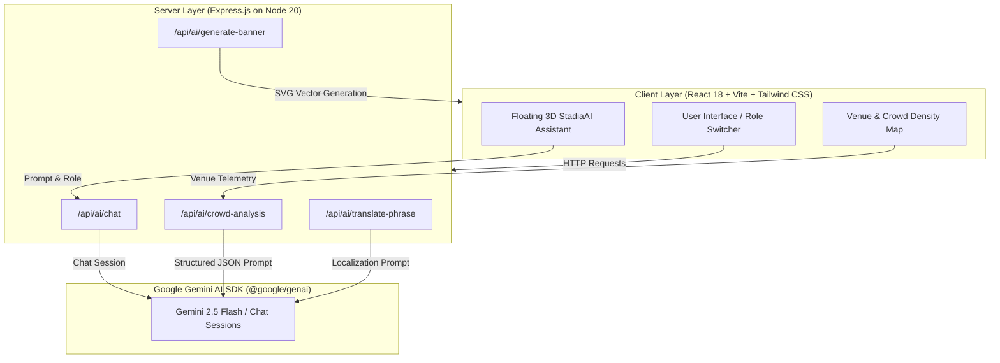

# StadiumOps — FIFA World Cup 2026 Smart Stadium Operations & Fan Experience Platform


**StadiumOps** is an advanced, full-stack multi-role web platform engineered for the **FIFA World Cup 2026** (hosted across the USA, Canada, and Mexico). It seamlessly connects Spectators, Stadium Operators, Volunteers, and VIPs with real-time crowd analytics, AI-powered multilingual translation, intelligent concierges, sustainable green tracking, tournament bracket management, and emergency response broadcast systems.

---

## 🌟 Key Features & Roles

1. **Fan Concierge ("StadiaAI")**:
   - Real-time AI chat powered by Gemini API with role-based personas.
   - Live gate wait times, food queue telemetry, stadium maps, and transit guidance.
   - Magnetic 3D floating assistant avatar with smooth animations.

2. **Stadium Operations Dashboard**:
   - Live density heatmaps for concourses and entry gates (MetLife, SoFi, AT&T Stadium, Estadio Azteca, BC Place, etc.).
   - AI-driven bottleneck prediction and automated crowd-clearing recommendations.

3. **Volunteer & Staff Assistant**:
   - Multilingual phrase generator supporting Spanish, French, Portuguese, Mandarin Chinese, Japanese, Korean, German, Italian, Arabic, Hindi, Dutch, and Russian with phonetic pronunciation guides.

4. **Crowd & Transit Density Map**:
   - Interactive zone selector monitoring security checkpoints, parking shuttles, and concession stand loads.

5. **Sustainability & Green Tracker**:
   - Tracking zero-waste metrics, reusable cup returns, solar energy usage, and carbon offset leaderboards across host venues.

6. **VIP Suite & Hospitality Pass**:
   - Digital luxury passes, private gate access QR codes, gourmet lounge menus, and concierge reservation requests.

7. **Emergency & Security Broadcast**:
   - Instant multilingual emergency alerts, severe weather warnings, evacuation route directional maps, and first responder dispatch logs.

8. **Live Tournament Bracket & Match Schedule**:
   - Group stage standings, knockout rounds, venue allocations, and match scores.

9. **AI Graphic Studio**:
   - Generative SVG & visual poster creator for custom FIFA World Cup 2026 match banners with one-click download.

---

## 📊 System Architecture & Workflow Diagram



---

## 🚀 Getting Started

### Prerequisites
- Node.js (v18+)
- npm or yarn

### Installation & Development
1. Clone the repository and install dependencies:
   ```bash
   npm install
   ```
2. Set up environment variables in `.env` (using `.env.example` as a template):
   ```env
   GEMINI_API_KEY=your_gemini_api_key_here
   ```
3. Run the development server:
   ```bash
   npm run dev
   ```
4. Build for production:
   ```bash
   npm run build
   ```
5. Start the production server:
   ```bash
   npm start
   ```

---

## 🛠️ Tech Stack
- **Frontend**: React 18, TypeScript, Vite, Tailwind CSS, Lucide React Icons
- **Backend**: Express.js, TypeScript, ESBuild bundled CJS output
- **AI Integration**: `@google/genai` SDK (Gemini Flash models)
- **Deployment**: Cloud Run container compatible
